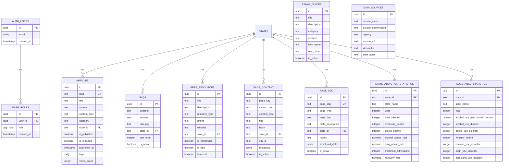

# United Rehabs - Project Documentation

## Table of Contents
1. [Project Overview](#project-overview)
2. [Technology Stack](#technology-stack)
3. [Project Structure](#project-structure)
4. [Database Schema](#database-schema)
5. [Authentication & Authorization](#authentication--authorization)
6. [Admin Panel](#admin-panel)
7. [Key Components](#key-components)
8. [Data Flow](#data-flow)
9. [Environment Variables](#environment-variables)
10. [Development Guide](#development-guide)

---

## Project Overview

United Rehabs is a comprehensive web application for finding addiction treatment and rehabilitation centers across the United States. The platform provides:

- **State-specific rehab center listings** with filtering capabilities
- **Addiction statistics** by state and substance type
- **Free resources** including helplines and support services
- **Educational content** via articles, guides, and FAQs
- **Admin dashboard** for content management

---

## Technology Stack

### Frontend
| Technology | Purpose |
|------------|---------|
| **React 18** | UI library |
| **TypeScript** | Type safety |
| **Vite** | Build tool & dev server |
| **Tailwind CSS** | Utility-first styling |
| **shadcn/ui** | Pre-built UI components |
| **React Router v6** | Client-side routing |
| **TanStack Query (React Query)** | Server state management |
| **Lucide React** | Icon library |
| **Recharts** | Data visualization |

### Backend (Lovable Cloud / Supabase)
| Service | Purpose |
|---------|---------|
| **PostgreSQL** | Database |
| **Row-Level Security (RLS)** | Data access control |
| **Supabase Auth** | User authentication |
| **Supabase Storage** | File/image storage |

---

## Project Structure

```
src/
├── components/
│   ├── admin/              # Admin-specific components
│   │   ├── BulkImportExport.tsx
│   │   └── PageTemplateGenerator.tsx
│   ├── article/            # Article/content components
│   │   ├── ImageUploader.tsx
│   │   ├── RelatedArticles.tsx
│   │   ├── RichContentEditor.tsx
│   │   ├── ShortcodeRenderer.tsx
│   │   └── TableOfContents.tsx
│   ├── auth/               # Authentication components
│   │   ├── TwoFactorManage.tsx
│   │   ├── TwoFactorSetup.tsx
│   │   └── TwoFactorVerify.tsx
│   ├── home/               # Homepage sections
│   │   ├── BrowseBySection.tsx
│   │   ├── CTACards.tsx
│   │   ├── FeaturedCenters.tsx
│   │   ├── HeroSection.tsx
│   │   ├── HowItWorks.tsx
│   │   ├── StatisticsSection.tsx
│   │   └── TestimonialsSection.tsx
│   ├── listing/            # Listing page components
│   │   ├── Breadcrumb.tsx
│   │   ├── FilterTabs.tsx
│   │   ├── Header.tsx
│   │   ├── Footer.tsx
│   │   ├── ImageGallery.tsx
│   │   ├── TreatmentCard.tsx
│   │   ├── TreatmentGrid.tsx
│   │   └── tabs/           # Tab content components
│   │       ├── FreeResourcesTab.tsx
│   │       ├── RehabListingsTab.tsx
│   │       ├── StatisticsTab.tsx
│   │       └── SubstanceCharts.tsx
│   └── ui/                 # shadcn/ui components
│
├── data/
│   └── mockData.ts         # Static/mock data for development
│
├── hooks/
│   ├── useAuth.ts          # Authentication hook
│   ├── useFilters.ts       # Filter state management
│   ├── useMFA.ts           # Multi-factor auth hook
│   └── usePageContent.ts   # Page content fetching
│
├── integrations/
│   └── supabase/
│       ├── client.ts       # Supabase client (auto-generated)
│       └── types.ts        # Database types (auto-generated)
│
├── lib/
│   ├── sanitize.ts         # HTML sanitization utilities
│   ├── utils.ts            # General utilities (cn, etc.)
│   └── validation.ts       # Form validation schemas
│
├── pages/
│   ├── admin/              # Admin panel pages
│   │   ├── ArticlesAdmin.tsx
│   │   ├── ContentAdmin.tsx
│   │   ├── Dashboard.tsx
│   │   ├── FAQsAdmin.tsx
│   │   ├── GuidesAdmin.tsx
│   │   ├── ResourcesAdmin.tsx
│   │   ├── SecurityAdmin.tsx
│   │   ├── SEOAdmin.tsx
│   │   ├── SourcesAdmin.tsx
│   │   ├── StatisticsAdmin.tsx
│   │   ├── SubstanceAdmin.tsx
│   │   └── URLsAdmin.tsx
│   ├── Admin.tsx           # Admin layout wrapper
│   ├── AdminLogin.tsx      # Admin authentication
│   ├── ArticlePage.tsx     # Single article view
│   ├── ArticlesListPage.tsx
│   ├── Index.tsx           # Homepage
│   ├── NotFound.tsx        # 404 page
│   ├── PrivacyPolicy.tsx
│   ├── StateRehabsPage.tsx # State rehab listings
│   ├── StateResourcesPage.tsx
│   ├── StateStatsPage.tsx
│   └── TermsOfService.tsx
│
├── types/
│   └── index.ts            # TypeScript type definitions
│
├── App.tsx                 # Main app with routing
├── App.css                 # Global styles
├── index.css               # Tailwind + CSS variables
└── main.tsx                # App entry point
```

---

## Database Schema

### Entity Relationship Diagram



### Relationship Summary

| Relationship | Type | Description |
|--------------|------|-------------|
| `auth.users` → `user_roles` | One-to-Many | User can have multiple roles |
| `states` → `articles` | One-to-Many | State can have many articles |
| `states` → `faqs` | One-to-Many | State can have many FAQs |
| `states` → `free_resources` | One-to-Many | State can have many resources |
| `states` → `page_content` | One-to-Many | State can have many content blocks |
| `states` → `page_seo` | One-to-Many | State can have many SEO configs |
| `states` → `state_addiction_statistics` | One-to-Many | State has yearly statistics |
| `states` → `substance_statistics` | One-to-Many | State has substance data by year |

> **Note:** The `states` table is conceptual - state data is stored via `state_id` text field (e.g., "ca", "tx") rather than a separate table. This allows flexibility for static state data in `mockData.ts`.

### Tables Overview

| Table | Purpose |
|-------|---------|
| `articles` | Blog posts, news, and educational content |
| `data_sources` | External data source references |
| `faqs` | Frequently asked questions |
| `free_resources` | Helplines and free services |
| `page_content` | Dynamic page content blocks |
| `page_seo` | SEO metadata for pages |
| `rehab_guides` | Educational rehabilitation guides |
| `state_addiction_statistics` | State-level addiction data |
| `substance_statistics` | Substance-specific statistics |
| `user_roles` | User permission management |

### Detailed Table Schemas

#### `articles`
Stores all content types: blogs, news, guides.

| Column | Type | Nullable | Default | Description |
|--------|------|----------|---------|-------------|
| `id` | uuid | No | `gen_random_uuid()` | Primary key |
| `slug` | text | No | - | URL-friendly identifier |
| `title` | text | No | - | Article title |
| `excerpt` | text | Yes | - | Short summary |
| `content` | text | Yes | - | Full article content (HTML/Markdown) |
| `content_type` | text | No | `'blog'` | Type: blog, news, guide |
| `category` | text | Yes | - | Content category |
| `author_name` | text | Yes | - | Author display name |
| `featured_image_url` | text | Yes | - | Hero image URL |
| `meta_title` | text | Yes | - | SEO title |
| `meta_description` | text | Yes | - | SEO description |
| `tags` | text[] | Yes | - | Content tags array |
| `state_id` | text | Yes | - | Associated state code |
| `is_published` | boolean | Yes | `false` | Publication status |
| `is_featured` | boolean | Yes | `false` | Featured flag |
| `published_at` | timestamptz | Yes | - | Publication date |
| `read_time` | text | Yes | `'5 min read'` | Estimated read time |
| `views_count` | integer | Yes | `0` | View counter |
| `sort_order` | integer | Yes | `0` | Display order |
| `created_at` | timestamptz | No | `now()` | Creation timestamp |
| `updated_at` | timestamptz | No | `now()` | Last update timestamp |

**RLS Policies:**
- `Anyone can view published articles` - SELECT where `is_published = true`
- `Admins can manage articles` - ALL for users with admin role

---

#### `data_sources`
Reference data for statistics citations.

| Column | Type | Nullable | Default | Description |
|--------|------|----------|---------|-------------|
| `id` | uuid | No | `gen_random_uuid()` | Primary key |
| `source_name` | text | No | - | Full source name |
| `source_abbreviation` | text | No | - | Short name (e.g., SAMHSA) |
| `agency` | text | No | - | Parent organization |
| `source_url` | text | No | - | Link to source |
| `description` | text | Yes | - | Source description |
| `data_types` | text[] | Yes | - | Types of data provided |
| `last_updated_year` | integer | Yes | - | Data currency year |
| `created_at` | timestamptz | No | `now()` | Creation timestamp |

**RLS Policies:**
- `Anyone can view data sources` - SELECT (public)
- `Admins can manage data sources` - ALL for admins

---

#### `faqs`
Frequently asked questions, optionally state-specific.

| Column | Type | Nullable | Default | Description |
|--------|------|----------|---------|-------------|
| `id` | uuid | No | `gen_random_uuid()` | Primary key |
| `question` | text | No | - | FAQ question |
| `answer` | text | No | - | FAQ answer (supports HTML) |
| `category` | text | Yes | - | FAQ category |
| `state_id` | text | Yes | - | State-specific FAQ |
| `sort_order` | integer | Yes | `0` | Display order |
| `is_active` | boolean | Yes | `true` | Visibility flag |
| `created_at` | timestamptz | No | `now()` | Creation timestamp |
| `updated_at` | timestamptz | No | `now()` | Last update timestamp |

**RLS Policies:**
- `Anyone can view active FAQs` - SELECT where `is_active = true`
- `Admins can manage FAQs` - ALL for admins

---

#### `free_resources`
Helplines, hotlines, and free support services.

| Column | Type | Nullable | Default | Description |
|--------|------|----------|---------|-------------|
| `id` | uuid | No | `gen_random_uuid()` | Primary key |
| `title` | text | No | - | Resource name |
| `description` | text | Yes | - | Resource description |
| `resource_type` | text | No | - | Type: helpline, website, etc. |
| `phone` | text | Yes | - | Contact phone number |
| `website` | text | Yes | - | Website URL |
| `address` | text | Yes | - | Physical address |
| `state_id` | text | Yes | - | State-specific resource |
| `is_nationwide` | boolean | Yes | `false` | National availability |
| `is_free` | boolean | Yes | `true` | Free service flag |
| `featured` | boolean | Yes | `false` | Featured resource |
| `sort_order` | integer | Yes | `0` | Display order |
| `created_at` | timestamptz | No | `now()` | Creation timestamp |
| `updated_at` | timestamptz | No | `now()` | Last update timestamp |

**RLS Policies:**
- `Anyone can view free resources` - SELECT (public)
- `Admins can manage free resources` - ALL for admins

---

#### `page_content`
Dynamic content blocks for pages.

| Column | Type | Nullable | Default | Description |
|--------|------|----------|---------|-------------|
| `id` | uuid | No | `gen_random_uuid()` | Primary key |
| `page_key` | text | No | - | Page identifier |
| `section_key` | text | No | - | Section within page |
| `content_type` | text | No | `'text'` | Content type |
| `title` | text | Yes | - | Section title |
| `subtitle` | text | Yes | - | Section subtitle |
| `body` | text | Yes | - | Main content |
| `country_code` | text | Yes | `'us'` | Country targeting |
| `state_id` | text | Yes | - | State targeting |
| `city_id` | text | Yes | - | City targeting |
| `metadata` | jsonb | Yes | `'{}'` | Additional data |
| `sort_order` | integer | Yes | `0` | Display order |
| `is_active` | boolean | Yes | `true` | Visibility flag |
| `created_at` | timestamptz | No | `now()` | Creation timestamp |
| `updated_at` | timestamptz | No | `now()` | Last update timestamp |

**RLS Policies:**
- `Anyone can view active page content` - SELECT where `is_active = true`
- `Admins can manage page content` - ALL for admins

---

#### `page_seo`
SEO metadata configuration for pages.

| Column | Type | Nullable | Default | Description |
|--------|------|----------|---------|-------------|
| `id` | uuid | No | `gen_random_uuid()` | Primary key |
| `page_slug` | text | No | - | Page URL path |
| `page_type` | text | No | `'state'` | Page category |
| `meta_title` | text | No | - | SEO title |
| `meta_description` | text | Yes | - | SEO description |
| `meta_keywords` | text[] | Yes | - | SEO keywords |
| `h1_title` | text | Yes | - | Page H1 heading |
| `intro_text` | text | Yes | - | Introduction text |
| `og_title` | text | Yes | - | Open Graph title |
| `og_description` | text | Yes | - | Open Graph description |
| `og_image_url` | text | Yes | - | Open Graph image |
| `canonical_url` | text | Yes | - | Canonical URL |
| `robots` | text | Yes | `'index, follow'` | Robots directive |
| `structured_data` | jsonb | Yes | - | JSON-LD schema |
| `state_id` | text | Yes | - | Associated state |
| `is_active` | boolean | Yes | `true` | Active flag |
| `created_at` | timestamptz | No | `now()` | Creation timestamp |
| `updated_at` | timestamptz | No | `now()` | Last update timestamp |

**RLS Policies:**
- `Anyone can view active page SEO` - SELECT where `is_active = true`
- `Admins can manage page SEO` - ALL for admins

---

#### `rehab_guides`
Educational guides about rehabilitation.

| Column | Type | Nullable | Default | Description |
|--------|------|----------|---------|-------------|
| `id` | uuid | No | `gen_random_uuid()` | Primary key |
| `title` | text | No | - | Guide title |
| `description` | text | No | - | Short description |
| `category` | text | No | - | Guide category |
| `content` | text | Yes | - | Full guide content |
| `icon_name` | text | Yes | `'BookOpen'` | Lucide icon name |
| `read_time` | text | Yes | `'5 min read'` | Reading time |
| `sort_order` | integer | Yes | `0` | Display order |
| `is_active` | boolean | Yes | `true` | Visibility flag |
| `created_at` | timestamptz | No | `now()` | Creation timestamp |
| `updated_at` | timestamptz | No | `now()` | Last update timestamp |

**RLS Policies:**
- `Anyone can view active guides` - SELECT where `is_active = true`
- `Admins can manage guides` - ALL for admins

---

#### `state_addiction_statistics`
State-level addiction and treatment statistics.

| Column | Type | Nullable | Default | Description |
|--------|------|----------|---------|-------------|
| `id` | uuid | No | `gen_random_uuid()` | Primary key |
| `state_id` | text | No | - | State code (e.g., 'ca') |
| `state_name` | text | No | - | Full state name |
| `year` | integer | No | - | Data year |
| `total_affected` | integer | Yes | - | Total affected population |
| `overdose_deaths` | integer | Yes | - | Overdose fatalities |
| `opioid_deaths` | integer | Yes | - | Opioid-specific deaths |
| `alcohol_abuse_rate` | numeric | Yes | - | Alcohol abuse percentage |
| `drug_abuse_rate` | numeric | Yes | - | Drug abuse percentage |
| `affected_age_12_17` | integer | Yes | - | Ages 12-17 affected |
| `affected_age_18_25` | integer | Yes | - | Ages 18-25 affected |
| `affected_age_26_34` | integer | Yes | - | Ages 26-34 affected |
| `affected_age_35_plus` | integer | Yes | - | Ages 35+ affected |
| `treatment_admissions` | integer | Yes | - | Treatment admissions |
| `recovery_rate` | numeric | Yes | - | Recovery percentage |
| `relapse_rate` | numeric | Yes | - | Relapse percentage |
| `total_treatment_centers` | integer | Yes | - | Treatment facility count |
| `inpatient_facilities` | integer | Yes | - | Inpatient centers |
| `outpatient_facilities` | integer | Yes | - | Outpatient centers |
| `economic_cost_billions` | numeric | Yes | - | Economic impact |
| `data_source` | text | Yes | - | Data source name |
| `source_url` | text | Yes | - | Source reference URL |
| `created_at` | timestamptz | No | `now()` | Creation timestamp |
| `updated_at` | timestamptz | No | `now()` | Last update timestamp |

**RLS Policies:**
- `Anyone can view statistics` - SELECT (public)
- `Admins can manage statistics` - ALL for admins

---

#### `substance_statistics`
Detailed substance-specific statistics by state.

| Column | Type | Nullable | Default | Description |
|--------|------|----------|---------|-------------|
| `id` | uuid | No | `gen_random_uuid()` | Primary key |
| `state_id` | text | No | - | State code |
| `state_name` | text | No | - | Full state name |
| `year` | integer | No | - | Data year |
| **Alcohol** | | | | |
| `alcohol_use_past_month_percent` | numeric | Yes | - | Monthly use % |
| `alcohol_binge_drinking_percent` | numeric | Yes | - | Binge drinking % |
| `alcohol_heavy_use_percent` | numeric | Yes | - | Heavy use % |
| `alcohol_use_disorder` | integer | Yes | - | Disorder count |
| `alcohol_related_deaths` | integer | Yes | - | Death count |
| **Opioids** | | | | |
| `opioid_use_disorder` | integer | Yes | - | Disorder count |
| `opioid_misuse_past_year` | integer | Yes | - | Yearly misuse |
| `prescription_opioid_misuse` | integer | Yes | - | Rx misuse |
| `heroin_use` | integer | Yes | - | Heroin users |
| `fentanyl_deaths` | integer | Yes | - | Fentanyl deaths |
| `fentanyl_involved_overdoses` | integer | Yes | - | Fentanyl ODs |
| **Cocaine** | | | | |
| `cocaine_use_past_year` | integer | Yes | - | Yearly use |
| `cocaine_use_disorder` | integer | Yes | - | Disorder count |
| `cocaine_related_deaths` | integer | Yes | - | Death count |
| **Methamphetamine** | | | | |
| `meth_use_past_year` | integer | Yes | - | Yearly use |
| `meth_use_disorder` | integer | Yes | - | Disorder count |
| `meth_related_deaths` | integer | Yes | - | Death count |
| **Marijuana** | | | | |
| `marijuana_use_past_month` | integer | Yes | - | Monthly use |
| `marijuana_use_past_year` | integer | Yes | - | Yearly use |
| `marijuana_use_disorder` | integer | Yes | - | Disorder count |
| **Prescriptions** | | | | |
| `prescription_tranquilizer_misuse` | integer | Yes | - | Tranquilizer misuse |
| `prescription_stimulant_misuse` | integer | Yes | - | Stimulant misuse |
| `prescription_sedative_misuse` | integer | Yes | - | Sedative misuse |
| **Treatment** | | | | |
| `treatment_received` | integer | Yes | - | Treated count |
| `treatment_needed_not_received` | integer | Yes | - | Untreated need |
| `mat_recipients` | integer | Yes | - | MAT patients |
| **Mental Health** | | | | |
| `mental_illness_with_sud` | integer | Yes | - | MI + SUD comorbidity |
| `serious_mental_illness_with_sud` | integer | Yes | - | SMI + SUD comorbidity |
| `created_at` | timestamptz | No | `now()` | Creation timestamp |
| `updated_at` | timestamptz | No | `now()` | Last update timestamp |

**RLS Policies:**
- `Anyone can view substance statistics` - SELECT (public)
- `Admins can manage substance statistics` - ALL for admins

---

#### `user_roles`
User authorization and role management.

| Column | Type | Nullable | Default | Description |
|--------|------|----------|---------|-------------|
| `id` | uuid | No | `gen_random_uuid()` | Primary key |
| `user_id` | uuid | No | - | References auth.users |
| `role` | app_role | No | `'viewer'` | User role enum |
| `created_at` | timestamptz | No | `now()` | Creation timestamp |

**Enum: `app_role`**
- `admin` - Full system access
- `editor` - Content management
- `viewer` - Read-only access

**RLS Policies:**
- `Users can view their own roles` - SELECT where `auth.uid() = user_id`
- `Admins can view all roles` - SELECT for admins
- `Admins can manage roles` - ALL for admins

---

### Database Functions

#### `has_role(user_id, role)`
Checks if a user has a specific role. Used in RLS policies.

```sql
CREATE FUNCTION public.has_role(_user_id uuid, _role app_role)
RETURNS boolean
LANGUAGE sql
STABLE
SECURITY DEFINER
SET search_path = public
AS $$
  SELECT EXISTS (
    SELECT 1
    FROM public.user_roles
    WHERE user_id = _user_id
      AND role = _role
  )
$$;
```

#### `update_updated_at_column()`
Trigger function to auto-update `updated_at` timestamps.

```sql
CREATE FUNCTION public.update_updated_at_column()
RETURNS trigger
LANGUAGE plpgsql
SET search_path = 'public'
AS $$
BEGIN
  NEW.updated_at = now();
  RETURN NEW;
END;
$$;
```

---

## Authentication & Authorization

### Authentication Flow
1. Users authenticate via Supabase Auth (email/password)
2. Upon login, check `user_roles` table for permissions
3. Admin access requires `admin` role in `user_roles`

### Authorization Architecture
```
┌─────────────────┐     ┌──────────────┐     ┌─────────────────┐
│   Frontend      │────▶│  Supabase    │────▶│  PostgreSQL     │
│   (React)       │     │  Auth        │     │  RLS Policies   │
└─────────────────┘     └──────────────┘     └─────────────────┘
                              │
                              ▼
                        ┌──────────────┐
                        │  user_roles  │
                        │  table       │
                        └──────────────┘
```

### Security Measures
- **Row-Level Security (RLS)** on all tables
- **SECURITY DEFINER** functions to prevent RLS recursion
- **Role-based access** via `user_roles` table (not stored on profiles)
- **Server-side validation** for all mutations

### Adding an Admin User
```sql
-- After user signs up, grant admin role
INSERT INTO public.user_roles (user_id, role)
VALUES ('user-uuid-here', 'admin');
```

---

## Admin Panel

### Routes
| Route | Component | Purpose |
|-------|-----------|---------|
| `/admin` | `Admin.tsx` | Admin layout wrapper |
| `/admin/login` | `AdminLogin.tsx` | Admin authentication |
| `/admin/dashboard` | `Dashboard.tsx` | Overview dashboard |
| `/admin/articles` | `ArticlesAdmin.tsx` | Content management |
| `/admin/content` | `ContentAdmin.tsx` | Page content blocks |
| `/admin/faqs` | `FAQsAdmin.tsx` | FAQ management |
| `/admin/resources` | `ResourcesAdmin.tsx` | Free resources |
| `/admin/guides` | `GuidesAdmin.tsx` | Rehab guides |
| `/admin/statistics` | `StatisticsAdmin.tsx` | State statistics |
| `/admin/substance` | `SubstanceAdmin.tsx` | Substance data |
| `/admin/sources` | `SourcesAdmin.tsx` | Data sources |
| `/admin/seo` | `SEOAdmin.tsx` | SEO configuration |
| `/admin/urls` | `URLsAdmin.tsx` | URL management |
| `/admin/security` | `SecurityAdmin.tsx` | Security settings |

### Features
- CRUD operations for all content types
- Bulk import/export functionality
- Page template generation
- Rich text editing with shortcode support

---

## Key Components

### Public Pages

#### `StateRehabsPage`
Displays rehab centers for a specific state with filtering.
- Uses `useFilters` hook for state management
- Loads SEO data from `page_seo` table
- Displays treatment centers with pagination

#### `StateStatsPage`
Shows addiction statistics for a state.
- Fetches from `state_addiction_statistics`
- Displays charts via `StatisticsTab`

#### `StateResourcesPage`
Lists free resources for a state.
- Fetches from `free_resources`
- Displays via `FreeResourcesTab`

### Hooks

#### `useAuth`
Authentication state management.
```typescript
const { user, loading, signIn, signOut, isAdmin } = useAuth();
```

#### `useFilters`
Filter state for treatment center listings.
```typescript
const { 
  filters, 
  setFilters, 
  centers, 
  loading, 
  loadMore 
} = useFilters(stateId);
```

#### `usePageContent`
Fetches dynamic page content.
```typescript
const { content, loading } = usePageContent(pageKey, sectionKey);
```

---

## Data Flow

### Public Content Flow
```
User Request → React Router → Page Component
                                    │
                                    ▼
                             useQuery Hook
                                    │
                                    ▼
                             Supabase Client
                                    │
                                    ▼
                              RLS Check
                                    │
                                    ▼
                             PostgreSQL
                                    │
                                    ▼
                              Response
```

### Admin Mutation Flow
```
Admin Action → Form Submit → useMutation
                                  │
                                  ▼
                           Supabase Client
                                  │
                                  ▼
                            Auth Check
                                  │
                                  ▼
                         RLS Policy Check
                                  │
                                  ▼
                       has_role() Function
                                  │
                                  ▼
                           PostgreSQL
                                  │
                                  ▼
                        Query Invalidation
```

---

## Environment Variables

The following environment variables are auto-configured:

| Variable | Description |
|----------|-------------|
| `VITE_SUPABASE_URL` | Supabase project URL |
| `VITE_SUPABASE_PUBLISHABLE_KEY` | Supabase anon key |
| `VITE_SUPABASE_PROJECT_ID` | Supabase project ID |

**Note:** These are auto-managed by Lovable Cloud. Do not edit `.env` directly.

---

## Development Guide

### Getting Started
```bash
# Install dependencies
npm install

# Start development server
npm run dev

# Build for production
npm run build
```

### Adding New Tables
1. Create migration via Lovable's migration tool
2. Define RLS policies (use `has_role()` for admin checks)
3. Types auto-generate to `src/integrations/supabase/types.ts`

### Adding Admin Pages
1. Create component in `src/pages/admin/`
2. Add route in `src/App.tsx` under admin routes
3. Use `useQuery`/`useMutation` for data operations
4. Follow existing admin page patterns

### Code Conventions
- **Components:** PascalCase, one component per file
- **Hooks:** camelCase, prefix with `use`
- **Types:** PascalCase, defined in `src/types/`
- **Styling:** Tailwind CSS with semantic tokens from `index.css`

### Testing Locally
1. Run `npm run dev`
2. Access at `http://localhost:5173`
3. Admin panel at `/admin/login`

---

## Storage Buckets

| Bucket | Public | Purpose |
|--------|--------|---------|
| `article-images` | Yes | Article featured images |

---

## File Upload Pattern
```typescript
import { supabase } from "@/integrations/supabase/client";

const uploadImage = async (file: File) => {
  const fileName = `${Date.now()}-${file.name}`;
  const { data, error } = await supabase.storage
    .from('article-images')
    .upload(fileName, file);
  
  if (error) throw error;
  
  const { data: { publicUrl } } = supabase.storage
    .from('article-images')
    .getPublicUrl(fileName);
  
  return publicUrl;
};
```

---

## State Page Scaling Guide

This guide documents the complete process for adding new state pages, using California as the reference implementation.

### Overview: California Implementation

California was built as the template state with three main page types:

| Page Type | URL Pattern | Component | Purpose |
|-----------|-------------|-----------|---------|
| **Rehabs** | `/{state}-addiction-rehabs` | `StateRehabsPage.tsx` | Treatment center listings with filters |
| **Statistics** | `/{state}-addiction-stats` | `StateStatsPage.tsx` | Addiction data & charts |
| **Resources** | `/{state}-addiction-free-resources` | `StateResourcesPage.tsx` | Free helplines & support |

### Step-by-Step: Adding a New State

#### Step 1: Update State Slug Map

Add the new state to the slug map in **all three page files**:

**Files to update:**
- `src/pages/StateRehabsPage.tsx`
- `src/pages/StateStatsPage.tsx`
- `src/pages/StateResourcesPage.tsx`

```typescript
// Add to stateSlugMap in each file
const stateSlugMap: Record<string, { id: string; name: string }> = {
  california: { id: "ca", name: "California" },
  texas: { id: "tx", name: "Texas" },
  florida: { id: "fl", name: "Florida" },
  "new-york": { id: "ny", name: "New York" },
  // ADD NEW STATE HERE:
  ohio: { id: "oh", name: "Ohio" },
  pennsylvania: { id: "pa", name: "Pennsylvania" },
};
```

> **Tip:** Consider extracting this to a shared constants file: `src/data/stateConfig.ts`

#### Step 2: Add Database Data

Use the admin panel to add state-specific data:

##### A. Addiction Statistics (`/admin/statistics`)
```sql
-- Example: Add Ohio statistics
INSERT INTO state_addiction_statistics (
  state_id, state_name, year, total_affected, overdose_deaths, 
  opioid_deaths, alcohol_abuse_rate, drug_abuse_rate,
  treatment_admissions, recovery_rate, data_source
) VALUES (
  'oh', 'Ohio', 2023, 850000, 4500, 3200, 
  7.2, 5.8, 125000, 42.5, 'SAMHSA NSDUH'
);
```

##### B. Substance Statistics (`/admin/substance`)
```sql
-- Example: Add Ohio substance data
INSERT INTO substance_statistics (
  state_id, state_name, year,
  alcohol_use_past_month_percent, alcohol_binge_drinking_percent,
  opioid_use_disorder, fentanyl_deaths, cocaine_use_disorder,
  meth_use_disorder, treatment_received
) VALUES (
  'oh', 'Ohio', 2023,
  52.5, 26.8, 145000, 2800, 38000, 22000, 95000
);
```

##### C. FAQs (`/admin/faqs`)
Add state-specific FAQs with `state_id = 'oh'`:
- "What are the best rehab centers in Ohio?"
- "Does Ohio Medicaid cover addiction treatment?"
- "How many treatment facilities are in Ohio?"

##### D. Free Resources (`/admin/resources`)
Add state-specific helplines with `state_id = 'oh'`:
- Ohio Crisis Text Line
- Ohio Department of Mental Health hotline
- Local treatment referral services

##### E. SEO Configuration (`/admin/seo`)
Add SEO entries for each page type:

| page_slug | page_type | meta_title |
|-----------|-----------|------------|
| `ohio-addiction-rehabs` | state | Ohio Addiction Rehab Centers |
| `ohio-addiction-stats` | state | Ohio Addiction Statistics |
| `ohio-addiction-free-resources` | state | Free Resources in Ohio |

#### Step 3: Add Page Content (Optional)

Use `/admin/content` to add dynamic content blocks:

```sql
INSERT INTO page_content (
  page_key, section_key, state_id, title, body, content_type
) VALUES 
  ('state_rehabs', 'intro', 'oh', 
   'Ohio Addiction Treatment', 
   'Ohio faces unique challenges with opioid addiction...', 
   'text'),
  ('state_rehabs', 'statistics_highlight', 'oh',
   'Key Statistics',
   'Over 850,000 Ohioans struggle with substance use disorders.',
   'highlight');
```

### Data Requirements Checklist

For each new state, ensure you have:

| Data Type | Table | Required Fields | Admin Page |
|-----------|-------|-----------------|------------|
| ✅ Basic Stats | `state_addiction_statistics` | state_id, state_name, year, total_affected | `/admin/statistics` |
| ✅ Substance Data | `substance_statistics` | state_id, state_name, year, substance counts | `/admin/substance` |
| ✅ FAQs | `faqs` | question, answer, state_id | `/admin/faqs` |
| ✅ Resources | `free_resources` | title, phone, state_id | `/admin/resources` |
| ✅ SEO | `page_seo` | page_slug, meta_title, meta_description | `/admin/seo` |
| ⭕ Content | `page_content` | page_key, section_key, state_id | `/admin/content` |

### URL Routing

Routes are already configured in `App.tsx` using dynamic slugs:

```tsx
// These routes handle ALL states automatically
<Route path="/:slug" element={<StateRehabsPage />} />
<Route path="/:slug" element={<StateStatsPage />} />
<Route path="/:slug" element={<StateResourcesPage />} />
```

The slug pattern matching in each component handles the routing:
- `california-addiction-rehabs` → California rehabs page
- `ohio-addiction-stats` → Ohio statistics page

### Component Architecture

```
StateRehabsPage
├── SEOHead (fetches from page_seo)
├── Header
├── Breadcrumb
├── PageHero
├── FilterTabs
├── ImageGallery
├── StateTabs
│   ├── RehabListingsTab (treatment centers)
│   ├── StatisticsTab (charts & data)
│   └── FreeResourcesTab (helplines)
├── Categories
├── FAQ (fetches from faqs where state_id = ?)
└── Footer
```

### Data Fetching Pattern

Each tab component fetches state-specific data:

```typescript
// Example: StatisticsTab data fetching
const { data: stats } = useQuery({
  queryKey: ['state-statistics', stateId],
  queryFn: async () => {
    const { data, error } = await supabase
      .from('state_addiction_statistics')
      .select('*')
      .eq('state_id', stateId)
      .order('year', { ascending: false });
    
    if (error) throw error;
    return data;
  }
});
```

### Bulk Import for Scaling

For adding multiple states quickly, use the bulk import feature:

1. Go to `/admin/statistics`
2. Click "Import/Export"
3. Upload CSV with state data:

```csv
state_id,state_name,year,total_affected,overdose_deaths,opioid_deaths
oh,Ohio,2023,850000,4500,3200
pa,Pennsylvania,2023,920000,5100,3800
mi,Michigan,2023,780000,3200,2400
```

### Testing New States

After adding a new state:

1. **Verify URLs work:**
   - `/{state}-addiction-rehabs`
   - `/{state}-addiction-stats`
   - `/{state}-addiction-free-resources`

2. **Check data loads:**
   - Statistics charts render
   - FAQs display correctly
   - Resources show for that state

3. **Verify SEO:**
   - Meta titles/descriptions appear
   - Breadcrumbs show correct state name
   - Page titles are dynamic

### Common Issues & Lessons Learned

When adding new states, watch out for these common pitfalls:

#### 1. Year Selection Defaults
**Problem:** The StatisticsTab defaults to the most recent available year dynamically. If a state only has data for 2021-2023 while another has 2024 data, the component automatically shows the most recent year for each state.

**Solution:** The component now uses `effectiveYear` which:
- Calculates the most recent year from available data
- Falls back to 2023 if no data exists
- Allows user selection to override the default

```typescript
// How year selection works
const mostRecentYear = statistics?.length 
  ? Math.max(...statistics.map(s => s.year)).toString() 
  : null;
const effectiveYear = selectedYear || mostRecentYear || "2023";
```

#### 2. Data Consistency Across Tables
**Problem:** Statistics showing but substance charts empty, or vice versa.

**Checklist:**
- [ ] `state_addiction_statistics` has records for the state
- [ ] `substance_statistics` has matching records with same `state_id` and overlapping years
- [ ] Both tables use the **same `state_id`** format (lowercase abbreviation: "ca", "fl", "tx")

#### 3. ImageGallery State Images
**Problem:** ImageGallery shows California images for other states.

**Current behavior:** The ImageGallery uses the state name dynamically but images are placeholder. Future improvement needed to add state-specific images.

#### 4. FAQs Not Showing
**Problem:** FAQ section is empty for new states.

**Checklist:**
- [ ] FAQs added with correct `state_id`
- [ ] FAQs have `is_active = true`
- [ ] FAQ component filters by state_id (verify it's not using mock data)

#### 5. Hardcoded State Names in Components
**Problem:** Some components (Sidebar, health behaviors sections) show "California" instead of the current state.

**Solution:** Components now accept `stateName` prop that flows from:
1. `StateRehabsPage` → gets state from `stateConfig.ts`
2. `StateTabs` → receives `stateName` prop
3. `RehabListingsTab` → passes `stateName` to child components
4. `Sidebar` → displays dynamic `stateName`

**Files to check:**
- `Sidebar.tsx` - uses `stateName` prop
- `RehabListingsTab.tsx` - passes `stateName` to Sidebar
- `StateTabs.tsx` - passes `stateName` to RehabListingsTab

#### 6. State Config Synchronization
**Problem:** `state_id` in database doesn't match `id` in `stateConfig.ts`.

**Important:** The `id` field in `stateConfig.ts` MUST match the `state_id` used in database tables:
- California: `id: "ca"` → database `state_id: "ca"`
- Florida: `id: "fl"` → database `state_id: "fl"`
- Texas: `id: "tx"` → database `state_id: "tx"`
- New York: `id: "ny"` → database `state_id: "ny"`

### QA Checklist for New States

When adding a new state, verify all of the following:

- [ ] State added to `src/data/stateConfig.ts` with correct `id`, `slug`, and `heroImages`
- [ ] Database has `state_addiction_statistics` records with matching `state_id`
- [ ] Database has `substance_statistics` records with matching `state_id` and years
- [ ] Database has `faqs` records with matching `state_id` and `is_active = true`
- [ ] Database has `free_resources` records with matching `state_id`
- [ ] Database has `page_seo` records for all 3 page types
- [ ] Navigation works: `/{state}-addiction-rehabs` loads correctly
- [ ] Statistics tab shows charts with data
- [ ] Substance charts show data
- [ ] Year selector defaults to most recent year with data
- [ ] Sidebar shows correct state name (not "California")
- [ ] FAQs display for the state
- [ ] Resources tab shows state-specific resources
- [ ] Page title/meta description are dynamic
- [ ] Filter button shows state name (not "California")
- [ ] Hero section shows state name and description
- [ ] Image gallery shows state-specific images

### Future Improvements

### Quick Reference: All 50 States

```typescript
const ALL_STATES = {
  alabama: { id: "al", name: "Alabama" },
  alaska: { id: "ak", name: "Alaska" },
  arizona: { id: "az", name: "Arizona" },
  arkansas: { id: "ar", name: "Arkansas" },
  california: { id: "ca", name: "California" },
  colorado: { id: "co", name: "Colorado" },
  connecticut: { id: "ct", name: "Connecticut" },
  delaware: { id: "de", name: "Delaware" },
  florida: { id: "fl", name: "Florida" },
  georgia: { id: "ga", name: "Georgia" },
  hawaii: { id: "hi", name: "Hawaii" },
  idaho: { id: "id", name: "Idaho" },
  illinois: { id: "il", name: "Illinois" },
  indiana: { id: "in", name: "Indiana" },
  iowa: { id: "ia", name: "Iowa" },
  kansas: { id: "ks", name: "Kansas" },
  kentucky: { id: "ky", name: "Kentucky" },
  louisiana: { id: "la", name: "Louisiana" },
  maine: { id: "me", name: "Maine" },
  maryland: { id: "md", name: "Maryland" },
  massachusetts: { id: "ma", name: "Massachusetts" },
  michigan: { id: "mi", name: "Michigan" },
  minnesota: { id: "mn", name: "Minnesota" },
  mississippi: { id: "ms", name: "Mississippi" },
  missouri: { id: "mo", name: "Missouri" },
  montana: { id: "mt", name: "Montana" },
  nebraska: { id: "ne", name: "Nebraska" },
  nevada: { id: "nv", name: "Nevada" },
  "new-hampshire": { id: "nh", name: "New Hampshire" },
  "new-jersey": { id: "nj", name: "New Jersey" },
  "new-mexico": { id: "nm", name: "New Mexico" },
  "new-york": { id: "ny", name: "New York" },
  "north-carolina": { id: "nc", name: "North Carolina" },
  "north-dakota": { id: "nd", name: "North Dakota" },
  ohio: { id: "oh", name: "Ohio" },
  oklahoma: { id: "ok", name: "Oklahoma" },
  oregon: { id: "or", name: "Oregon" },
  pennsylvania: { id: "pa", name: "Pennsylvania" },
  "rhode-island": { id: "ri", name: "Rhode Island" },
  "south-carolina": { id: "sc", name: "South Carolina" },
  "south-dakota": { id: "sd", name: "South Dakota" },
  tennessee: { id: "tn", name: "Tennessee" },
  texas: { id: "tx", name: "Texas" },
  utah: { id: "ut", name: "Utah" },
  vermont: { id: "vt", name: "Vermont" },
  virginia: { id: "va", name: "Virginia" },
  washington: { id: "wa", name: "Washington" },
  "west-virginia": { id: "wv", name: "West Virginia" },
  wisconsin: { id: "wi", name: "Wisconsin" },
  wyoming: { id: "wy", name: "Wyoming" },
};
```

---

## Contact & Support

For questions about this project, refer to:
- This documentation
- Code comments
- Lovable's documentation at https://docs.lovable.dev
